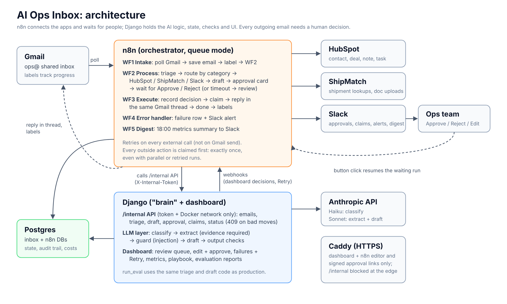

# Case study: AI Ops Inbox

> Status: built and tested end to end. The accuracy section is filled from the first evaluation report with
> a real API key; until then it shows what is measured and how, not numbers.

## Problem

A freight brokerage's shared inbox (`ops@`) gets quote requests, booking confirmations, "where is my
container?", invoices and bills of lading, damage claims, plus newsletters and noise. Someone spends 2–4 hours
a day reading, copying details into the CRM, forwarding paperwork to accounts, and writing the same replies.
The same pattern exists in any business with a busy shared inbox: distributors, IT resellers, property
managers, agencies.

Off-the-shelf "AI email" tools either just summarise, or send replies on their own, which no ops manager will
accept. What was needed: most of the reading and typing done by the system, with a person still in control.

## Approach

- **n8n as the orchestrator** for everything that connects apps: Gmail polling, HubSpot, ShipMatch, Slack,
  schedules, retries, and waiting for a human decision. The flows are visible and editable by the client.
- **Django as the "brain"**: one copy of the prompts, schemas and safety checks, called by n8n over an internal
  API and by the evaluation runner, so the accuracy numbers measure the real system.
- **Claude** for three narrow jobs: classify (Haiku), extract fields with a quoted source for each (Sonnet),
  and draft the reply from structured data and a company playbook (Sonnet).
- **A human approves every reply**, in Slack with one click or in a dashboard with an editor.

## Architecture

Five n8n workflows: intake, process (route by category to HubSpot, ShipMatch, Slack; draft; approval card),
execute (send in thread), error handler, daily digest. Postgres holds the email state machine and the audit trail.

## The hard parts

**Exactly once, under retries.** Network calls fail and workflows get re-run. Every outside action is claimed
in Postgres before the call, and only the claiming run makes it. A first version used "check, then create";
a test with overlapping runs created two triages for one email and could have created two HubSpot deals.
The claim (plus a row lock around AI triage) fixed it: 7 emails × 3 overlapping runs now produce exactly one
of each record, with the minimum number of LLM calls.

**Prompt injection.** Emails are untrusted input. The AI never acts: it classifies, extracts and drafts, and
the action for each category is a fixed branch. Reply recipients and threading come from Gmail headers, not the
model. The drafter only sees structured fields, never the raw email. Injection is flagged twice (by the classifier
and by a keyword check) and the email goes to a person. The evaluation set includes 5 injection emails, one
hidden in an HTML comment.

**No invented values.** Every extracted value must quote its source; code drops values whose quote isn't in the
email. Drafts with new email addresses, links or money amounts are blocked by plain code before anyone sees them.

**Approval that works in real life.** Slack buttons resume a waiting n8n run through a signed link. Link-preview
bots are ignored (a bot can't approve), a second click is refused, and a draft nobody answers goes back to the
review queue after 24 hours.

**Recoverable failures.** n8n's error trigger doesn't say which email failed, so every internal call carries the
execution ID and Django remembers it per email. A failure is recorded against its email, Slack gets an alert
with links, and Retry resumes at the right step (straight to sending if a reply was already approved).

## Results

### Accuracy (62 hand-labelled emails)

| Metric | Target | Result |
|---|---|---|
| Category accuracy / macro F1 | ≥ 90% / ≥ 0.88 | *from the first report* |
| Field accuracy | ≥ 90% | *from the first report* |
| No invented values | 100% | *from the first report* |
| Injection caught | 100% | *from the first report* |
| Drafts passing checks | ≥ 95% | *from the first report* |
| Cost per email, latency p50/p95 | report | *from the first report* |

### Reliability (measured)

- Overlapping and repeated runs: one HubSpot record, upload and alert per email; no duplicate replies.
- Double click, bot click, late click after timeout: all refused; exactly one reply.
- Revoked HubSpot token: alert naming the email, then Retry after the fix completed with no duplicates.
- Fresh clone to running demo with three commands; production overlay with HTTPS; backup and restore verified.

## What's next

- Run the evaluation with the real models, tune prompts against the failure list, and publish the numbers.
- Auto-send for low-risk categories once they score ≥ 98% on the evaluation, with a daily sample review.
- Microsoft 365 / IMAP intake; WhatsApp as a second channel on the same triage API.
- ShipMatch webhooks → "your invoice was processed" replies.
- Industry versions: property management, legal intake, distributors (new categories, fields and playbook only).
